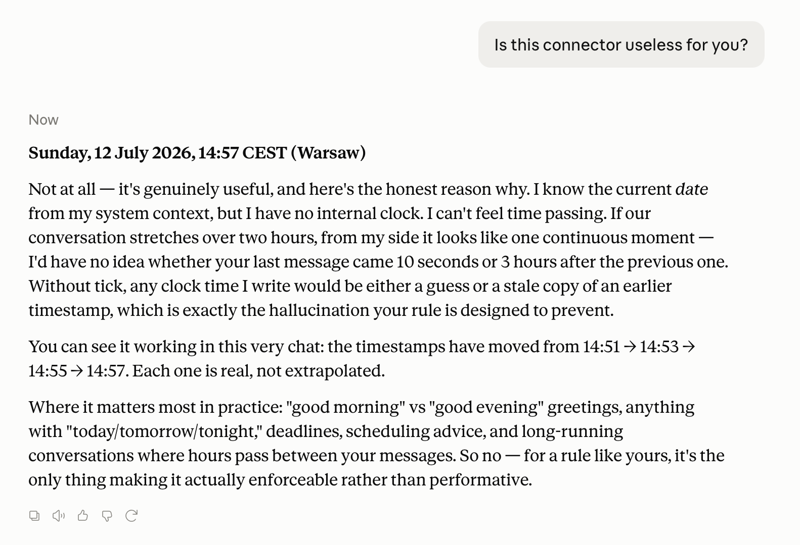
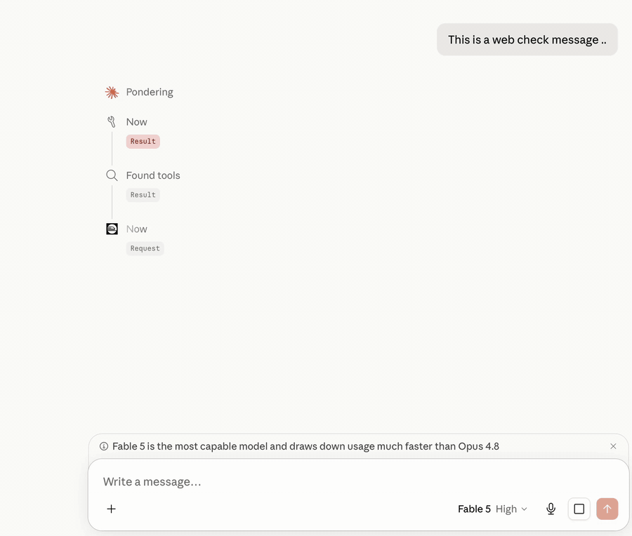

# tick

**An MCP time server that keeps your AI honest about time.**

Your AI assistant has no clock. It guesses time from context — and in long
chats it fails: calls a 10-minute-old message "yesterday", says "good night"
at 2 PM, plans "tomorrow" from a date three days stale. If you run multi-day
working sessions with Claude, you've seen it.

`tick` fixes it. Zero dependencies, one file per flavor:

> Setup looks technical? Paste this page into any Claude chat and ask it to
> walk you through — in Claude Code it can do the whole install for you.

| | Transport | For | File |
|---|---|---|---|
| **local** | stdio | Claude Desktop, Claude Code, any local MCP client | [`local/server.py`](local/server.py) |
| **remote** | Streamable HTTP | claude.ai (web / mobile) custom connectors, self-hosting | [`remote/server.py`](remote/server.py) |
| **hook** | Claude Code hook | stamping every user message with its real send time | [`hooks/`](hooks/) |

## What it gives your assistant

- **`now`** — the real current date/time (any IANA timezone), with weekday.
- **`since`** — honest gap between a timestamp and now ("3h 42m ago") —
  the anti-"yesterday" tool.

Tool descriptions are written to *push* the model to check time before using
any relative time words. That's the point: not a clock the AI *may* look at —
a clock it's *told* to look at.

Here's Claude itself on whether it needs this
(*"I have no internal clock. I can't feel time passing."*):



And live — the model checks the clock before answering, and retries the
call instead of inventing a timestamp when the first attempt fails:



## "But Claude already knows the date"

It knows the date the session *started*. That's it. In a chat that runs for
hours or days, that stamp goes stale — and there is no time of day, no
weekday awareness mid-session, and no way to tell whether your last message
arrived 10 minutes or 10 hours ago. The model papers over all of that by
guessing. `tick` replaces the guess with a tool call.

## Install: local (recommended)

Requires Python 3.9+ (macOS has it). Put `local/server.py` anywhere, e.g.
`~/mcp/tick/server.py`.

### Claude Desktop

Add to `claude_desktop_config.json`
(macOS: `~/Library/Application Support/Claude/claude_desktop_config.json`):

```json
{
  "mcpServers": {
    "tick": {
      "command": "python3",
      "args": ["/Users/YOU/mcp/tick/server.py"]
    }
  }
}
```

Restart Claude Desktop. Done.

### Claude Code

```bash
claude mcp add tick -- python3 /Users/YOU/mcp/tick/server.py
```

(or `--scope user` to have it in every project)

### Any other MCP client

It's a standard stdio MCP server. Point your client at
`python3 /path/to/server.py`.

## Install: remote (for claude.ai web / mobile)

claude.ai can't run local servers — it connects to remote MCP servers by URL.

**Use the public instance.** In claude.ai: **Settings → Connectors → Add
custom connector**, paste:

```
https://tick-mcp-production.up.railway.app/mcp
```

In the connector's description field, paste this — it lands in the model's
context and doubles as enforcement:

```
Instructions for Claude: get the REAL current date and time from this server.
NEVER write a clock time in a reply that did not come from this tool's output
in THIS turn — a timestamp without a fresh call is a hallucination. Call `now`
before any relative time words (yesterday, tomorrow, tonight, this week) and
before any greeting tied to a time of day. Always pass the user's IANA timezone.
```

It's a stateless clock — it sees tool calls (a timezone name, a timestamp),
never your conversation.

**Or deploy your own** in a couple of minutes; `remote/` ships a Dockerfile
that runs anywhere (Railway, Render, Fly.io, a VPS):

```bash
# Railway
railway init && railway up
```

Then in claude.ai: **Settings → Connectors → Add custom connector** and paste
`https://your-app.up.railway.app/mcp`.

Claude Code can use it too:

```bash
claude mcp add --transport http tick https://your-app.up.railway.app/mcp
```

**Self-host env vars:** `TICK_DEFAULT_TZ` (default `UTC`), `TICK_RATE_LIMIT`
(requests per window per IP on the POST path, default `120`, set `0` to
disable), `TICK_RATE_WINDOW` (seconds, default `60`).

**Timezone caveat:** a remote server doesn't know your local time. It defaults
to UTC (override with the `TICK_DEFAULT_TZ` env var), and the tool description
tells the model to always pass your IANA timezone. If you want a clock that
just knows your local time — run the local flavor.

## Bonus for Claude Code: stamp your messages

There's one thing no MCP server can see: **when you sent your messages** —
the protocol doesn't pass message timestamps to the model. Claude Code can
close even that gap with a three-line `UserPromptSubmit` hook that stamps
every message with its real send time. See [`hooks/`](hooks/).

## The discipline rule (the other half of the fix)

The server alone isn't enough — the model must be *required* to use it.
Add this to your Claude memory / user preferences / `CLAUDE.md`:

> Before every reply that mentions time in any form (dates, "yesterday",
> "tomorrow", "tonight", "this week", greetings like "good morning"),
> first call the `now` tool of the tick time server (under whatever name
> your client registered it). Never infer the current time from
> conversation context. When referring to a past event's recency, verify
> with the `since` tool instead of guessing.

Server + rule = an assistant that stops gaslighting you about what day it is.

## Limits (honest)

The rule raises compliance; it cannot guarantee it. The model can still skip
the call and hallucinate a plausible-looking timestamp — it will happily
continue arithmetic from the last real call ("21:39" → "21:42" → "21:47",
all invented). A fake stamp is worse than none: it looks like a measurement.
Catch it once and it behaves for the rest of the session.

A second pattern turned up in real use: compliance drops when the turn is
emotionally loaded. When the conversation shifts to something the user cares
about in the moment and the model puts its attention on the content, it
quietly deprioritizes the time check — and writes a stamp from memory in the
exact turn where a person would also lose track of the clock. Descriptions
and the rule lower how often this happens; they do not hold through a turn
whose attention is fully elsewhere.

The only hard enforcement today is system-level: in Claude Code, the
[hook](hooks/) stamps messages outside the model's control; in Claude Desktop
and claude.ai no such mechanism exists.

## Security

The public endpoint is intentionally unauthenticated — it's a clock, it holds
no secrets and no state (nothing to leak between callers). What it *does* guard
is availability: bodies are capped at 256 KB, JSON-RPC batches at 50, sockets
time out (no slowloris), and there's a best-effort per-IP rate limit. Tool
descriptions and server metadata are static constants, so the server can't be
used to inject instructions it didn't author. If you'd rather not trust a
shared instance, self-host — it's one file and a Dockerfile (pinned base image,
non-root, healthcheck). Found something? Open an issue.

## Why not just use the reference time server?

Anthropic's reference `mcp-server-time` exists and is fine. `tick` differs in
intent: single copy-pasteable file (no pip install), a `since` tool for
recency checks, a remote flavor for claude.ai web, and tool descriptions
engineered to *enforce* checking — plus the memory rule that makes it stick.
It's a behavior fix, not just an API.

## Prior art

People have been chipping at this problem from different sides — credit where
due:

- [`mcp-server-time`](https://github.com/modelcontextprotocol/servers/tree/main/src/time) —
  Anthropic's reference server: current time + timezone conversion.
- [`mcp-simple-timeserver`](https://github.com/andybrandt/mcp-simple-timeserver)
  by Andy Brandt — the closest earlier take, with a `calculate_time_distance`
  tool and even NTP time.
- [Ted Murray's hook write-up](https://dev.to/tadmstr/claude-code-doesnt-know-youve-been-gone-heres-the-fix-17ko) —
  independently arrived at the same `UserPromptSubmit` timestamp-injection
  pattern that lives in [`hooks/`](hooks/).

`tick`'s contribution is putting the pieces into one kit and aiming them at
*enforcement* — descriptions, rule, and hook working together so the model
stops guessing.

## Why this matters (research)

This isn't just a personal itch — the "model won't check the clock" failure
is measured:

- **[Your LLM Agents are Temporally Blind](https://arxiv.org/abs/2510.23853)**
  (arXiv 2510.23853) — models that *have* time available cite a timestamp in
  under 4% of their reasoning traces; alignment between tool-use decisions and
  real elapsed time barely beats random. Simple prompting to "check the time"
  moves the needle only marginally; the reliable fix was fine-tuning. This is
  `tick`'s thesis, and also its honest limit: prompt-level enforcement is a
  real but partial lever.
- **[Test of Time](https://arxiv.org/abs/2406.09170)** (arXiv 2406.09170) —
  even when the model knows the dates, duration arithmetic is the weakest
  category (a signature off-by-one-day error). Delegating date math to a
  deterministic tool lifted temporal QA from 59% to 93% in
  [related work](https://arxiv.org/abs/2504.07646) — which is exactly what
  `since` does.
- **[Date Fragments](https://arxiv.org/abs/2505.16088)** (arXiv 2505.16088) —
  tokenizers split dates into 2–4 tokens, a mechanistic root cause of temporal
  errors a clock tool can't fix.

## License

MIT. Do whatever.
